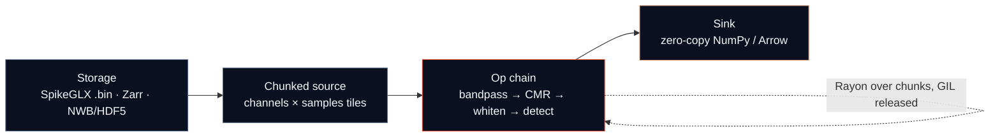

<p align="center">
  
</p>

<p align="center">
  <a href="https://github.com/fcarvajalbrown/Segovia/actions/workflows/ci.yml"></a>
  <a href="https://crates.io/crates/segovia"></a>
  <a href="https://pypi.org/project/segovia/"></a>
  <a href="https://docs.rs/segovia"></a>
  <a href="#license"></a>
  <a href="#status"></a>
  <a href="CONTRIBUTING.md"></a>
</p>

> A fast, chunked, **memory-bounded Rust engine for electrophysiology** signal processing — Neuropixels-scale, callable from Python.

**Segovia** is a lazy-evaluated, chunked, concurrent compute engine for massive multi-channel
electrophysiology time-series (Neuropixels-scale: 30 kHz × thousands of channels). It is written in
**Rust**, exposed to **Python** via [PyO3](https://github.com/PyO3/pyo3), and built to slot into the
existing neuroscience stack — **SpikeInterface**, **SpikeGLX**, **Zarr**, and **NWB** — rather than
replace it. The aim is **out-of-core, bounded-memory streaming preprocessing** (bandpass filtering,
common-median referencing, whitening) with **GIL-released shared-memory threads** instead of the
process-pool / pickle / per-process-copy model that makes Python spike-sorting pipelines run out of
memory.

## Status

**Active development.** Three chunked, memory-bounded readers stream a recording as
`(samples, channels)` `int16` chunks behind a shared `ChunkSource` contract — a **SpikeGLX
`.meta`/`.bin` reader** (`segovia.SpikeGlxReader`), a **Zarr reader** (`segovia.ZarrReader`,
gzip/zstd/blosc), and an **mtscomp `.cbin` reader** (`segovia.CbinReader`) — all published at v0.3.0
to [crates.io](https://crates.io/crates/segovia) and [PyPI](https://pypi.org/project/segovia/), so
`pip install segovia` works today. The streaming **bandpass → CMR → whiten** preprocessing chain
(`reader.preprocess(...)`) is **implemented and validated** against a whole-signal scipy reference and
ships in the next release (v0.4.0). The bounded-memory streaming premise has been measured on real IBL
Neuropixels data — see [Performance](#performance). Follow the [roadmap](ROADMAP.md) for progress.

## Contents

- [Why Segovia](#why-segovia)
- [How it works](#how-it-works)
- [Install](#install)
- [Quickstart](#quickstart)
- [Performance](#performance)
- [Architecture](#architecture)
- [Roadmap](#roadmap)
- [Why the name](#why-the-name)
- [Contributing](#contributing)
- [Citation](#citation)
- [License](#license)

## Why Segovia

A neuroscience lab can record a brain faster than its software can read it back. A single
high-density Neuropixels probe writes roughly **80 GB/hour (~22 MB/s)**; standard Python pipelines
load that at double size and then copy it wholesale into every worker process. Documented failures
include a **26 GiB** memory error filtering a modest recording and a **102 GiB** blow-up during
motion correction. The data is fine — the plumbing leaks.

Segovia targets that plumbing. It is **CPU-first** (the workload is IO/memory-bound, so a GPU would
spend more time waiting on the PCIe bus than computing), reuses mature Rust storage crates
(`zarrs`, `hdf5-metno`, `arrow-rs`) instead of reinventing them, and earns its keep through one
concrete advantage: **true shared-memory threading in Rust with the GIL released**. This is
**out-of-core spike-sorting preprocessing** — bounded memory regardless of recording length, real-time
capable, and callable from the Python tools researchers already use.

## How it works



Data is read in **chunks** (spans of channels × samples), streamed through an operation chain, and
returned to Python **zero-copy**. Only a bounded window is ever resident in memory — the metaphor is
the **Aqueduct of Segovia**, a continuous stream carried span-by-span across a row of stone arches.

## Install

```bash
pip install segovia
```

```bash
cargo add segovia
```

> The published package (v0.3.0) ships the three readers. The `reader.preprocess(...)` chain shown
> below lands in v0.4.0; until then it is available by building this branch with `maturin develop --release`.

## Quickstart

Open a recording with any reader, then stream the bandpass → common-median-reference → whiten chain
in bounded memory. `preprocess` yields `float32 (samples, channels)` chunks one at a time, releasing
the GIL during compute; only a bounded window is ever resident.

```python
import numpy as np
import segovia
from scipy import signal

reader = segovia.SpikeGlxReader(
    "data/probe0.imec0.ap.bin", "data/probe0.imec0.ap.meta"
)

sos = np.ascontiguousarray(
    signal.butter(5, [300, 6000], btype="band", fs=reader.sample_rate, output="sos"),
    dtype=np.float64,
)

for chunk in reader.preprocess(
    sos,
    chunk_samples=30_000,
    margin=1_500,
    calib_samples=60_000,
    whiten=True,
):
    ...
```

`segovia.ZarrReader`, `segovia.CbinReader`, and `segovia.SyntheticEphysReader` expose the same
`preprocess(...)` interface — the chain is reader-agnostic.

## Performance

Segovia's differentiation is **bounded-memory streaming**, measured on real IBL Neuropixels AP-band
data, not raw throughput. The headline results:

- **Bounded, file-size-independent memory.** On a real 1-hour IBL recording the
  bandpass → CMR → whiten chain holds **~1 GB peak RSS**, independent of recording length, where
  SpikeInterface's worker pools use 1.75 GB (thread) / 2.84 GB (process) and the process pool OOMs at
  `n_jobs = 8` on a 7.8 GB-RAM machine. Resident memory is `batch × (chunk + 2·margin) × channels` by
  construction — the bound that holds for a 1-minute clip holds for a full hour.

- **Lower latency and tighter deadlines in the online regime.** Streamed one chunk at a time at the
  true acquisition rate (`batch = 1`), Segovia meets a **300 ms real-time budget on 100% of chunks at
  0.28 GB** on real compressed `.cbin` data, versus **69.5% at 0.52 GB** for SpikeInterface's online
  `get_traces` — whose per-chunk tail latency (p99 366 ms) overruns the deadline. Segovia leads on
  mean latency, tail latency, deadline-adherence, memory, and throughput at every chunk size tested.

- **Honest scope.** This is the *online streaming* regime. For *batch* throughput with
  SpikeInterface's parallel executor, the two **tie** on speed (Segovia ~0.84× SI's thread pool) — the
  "faster than SpikeInterface" framing was measured and dropped; the genuine, file-size-independent win
  is bounded memory and online latency. Full method, numbers, and caveats:
  [`docs/research/`](docs/research/) (the replay-latency and online-latency comparison reports) and
  [ADR 0013](docs/architecture/adr/0013-preprocessing-chain-and-sc1.md).

## Architecture

The full architecture document set lives in [`docs/architecture/`](docs/architecture/):

- [`ARD.md`](docs/architecture/ARD.md) — requirements, NFRs, risks, decisions.
- [`candidate-architectures.md`](docs/architecture/candidate-architectures.md) — four options, trade-offs, recommendation.
- [`tech-stack.md`](docs/architecture/tech-stack.md) — concrete crate choices and their sharp edges.
- [`roadmap.md`](docs/architecture/roadmap.md) — the milestone-level plan.
- [`adr/`](docs/architecture/adr/) — Architecture Decision Records.

## Roadmap

[`ROADMAP.md`](ROADMAP.md) is the single source of truth for version and scope. In short: learn the
domain and de-risk the toolchain (M0–2), **establish the bounded-memory streaming result** (M2–4,
resolved — see [Performance](#performance)), grow into a real engine with a Python API (M4–7), add
breadth and correctness (M7–10), and ship as a SpikeInterface preprocessing backend (M10–12). A
deferred, gated single-cell vertical sits beyond that —
see [`docs/future/leukemia-direction.md`](docs/future/leukemia-direction.md).

## Why the name

Segovia is named for **Claudio Segovia**, a friend who died of leukemia at 26. The name also evokes
the **Aqueduct of Segovia** — a continuous stream carried across a long row of segmented stone arches,
which is exactly this engine's chunked, span-by-span streaming model.

The connection is honest, not a marketing claim. An electrophysiology engine does not cure cancer, and
saying otherwise would be dishonest. But the underlying computational problem — data too large for
memory, and a Python layer that copies it until it chokes — is shared with **single-cell genomics**,
the computational backbone of modern leukemia research (clonal evolution, drug resistance, CAR-T).
Segovia's core is kept **domain-neutral** so the same machinery could one day help with that work too:
**aided by the tool, not a tool made for it.** That direction is deliberately deferred and gated —
the honest details, including disconfirming evidence, are in
[`docs/future/leukemia-direction.md`](docs/future/leukemia-direction.md).

## Contributing

Contributions are welcome — see [`CONTRIBUTING.md`](CONTRIBUTING.md). The project is Windows-first,
uses a Rust + PyO3 + maturin toolchain, conventional commits, and STAR-format PRs.

## Citation

If you use Segovia in your research, please cite it via [`CITATION.cff`](CITATION.cff) (GitHub shows a
"Cite this repository" button). A DOI will be added on the first archived release.

## License

Segovia is licensed under the **GNU Affero General Public License v3.0 or later**
([AGPL-3.0-or-later](LICENSE)).

This is deliberate: Segovia is free for everyone — researchers, individuals, and non-profits — and the
copyleft terms keep it that way. Anyone who distributes Segovia, or runs a modified version as a
network service, must release their complete corresponding source under the same license, so the
project cannot be taken closed-source or proprietary.

Unless you explicitly state otherwise, any contribution you submit for inclusion is licensed under
AGPL-3.0-or-later, without any additional terms or conditions.
