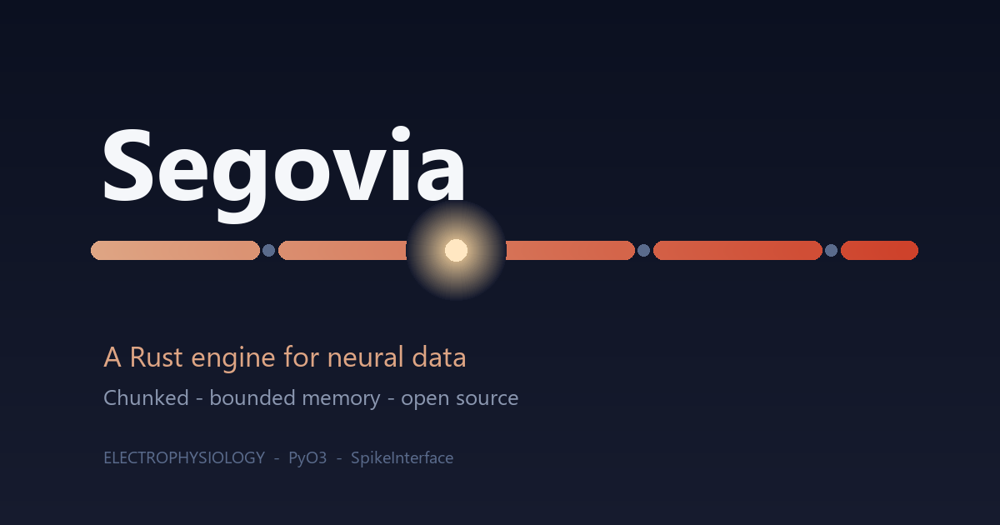
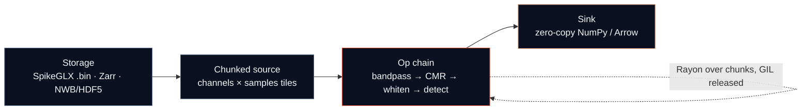

<p align="center">
  
</p>

<p align="center">
  <a href="https://github.com/fcarvajalbrown/Segovia/actions/workflows/ci.yml"></a>
  <a href="https://crates.io/crates/segovia"></a>
  <a href="https://pypi.org/project/segovia/"></a>
  <a href="https://docs.rs/segovia"></a>
  <a href="#license"></a>
  <a href="#status"></a>
  <a href="CONTRIBUTING.md"></a>
</p>

> A fast, chunked, **memory-bounded Rust engine for electrophysiology** signal processing — Neuropixels-scale, callable from Python.

**Segovia** is a lazy-evaluated, chunked, concurrent compute engine for massive multi-channel
electrophysiology time-series (Neuropixels-scale: 30 kHz × thousands of channels). It is written in
**Rust**, exposed to **Python** via [PyO3](https://github.com/PyO3/pyo3), and built to slot into the
existing neuroscience stack — **SpikeInterface**, **SpikeGLX**, **Zarr**, and **NWB** — rather than
replace it. The aim is **out-of-core, bounded-memory streaming preprocessing** (bandpass filtering,
common-median referencing, whitening) with **GIL-released shared-memory threads** instead of the
process-pool / pickle / per-process-copy model that makes Python spike-sorting pipelines run out of
memory.

## Status

**Early development — pre-MVP.** This repository is currently architecture docs plus a project
scaffold; the compute engine is not built yet and **nothing is published to crates.io or PyPI**. The
install and quickstart below describe the **target** API, not a shipped one. Follow the
[roadmap](ROADMAP.md) for progress. The whole premise rests on one make-or-break benchmark — see
[The benchmark gate](#the-benchmark-gate).

## Contents

- [Why Segovia](#why-segovia)
- [How it works](#how-it-works)
- [Install](#install)
- [Quickstart](#quickstart)
- [The benchmark gate](#the-benchmark-gate)
- [Architecture](#architecture)
- [Roadmap](#roadmap)
- [Why the name](#why-the-name)
- [Contributing](#contributing)
- [Citation](#citation)
- [License](#license)

## Why Segovia

A neuroscience lab can record a brain faster than its software can read it back. A single
high-density Neuropixels probe writes roughly **80 GB/hour (~22 MB/s)**; standard Python pipelines
load that at double size and then copy it wholesale into every worker process. Documented failures
include a **26 GiB** memory error filtering a modest recording and a **102 GiB** blow-up during
motion correction. The data is fine — the plumbing leaks.

Segovia targets that plumbing. It is **CPU-first** (the workload is IO/memory-bound, so a GPU would
spend more time waiting on the PCIe bus than computing), reuses mature Rust storage crates
(`zarrs`, `hdf5-metno`, `arrow-rs`) instead of reinventing them, and earns its keep through one
concrete advantage: **true shared-memory threading in Rust with the GIL released**. This is
**out-of-core spike-sorting preprocessing** — bounded memory regardless of recording length, real-time
capable, and callable from the Python tools researchers already use.

## How it works



Data is read in **chunks** (spans of channels × samples), streamed through an operation chain, and
returned to Python **zero-copy**. Only a bounded window is ever resident in memory — the metaphor is
the **Aqueduct of Segovia**, a continuous stream carried span-by-span across a row of stone arches.

## Install

> Not yet published — this is the planned install once the first release ships.

```bash
pip install segovia
```

```bash
cargo add segovia
```

## Quickstart

> Target API (illustrative, not yet shipped). Read a SpikeGLX recording, run the
> bandpass → common-median-reference → whiten chain in bounded memory, and get a zero-copy NumPy result.

```python
import segovia

recording = segovia.read_spikeglx("data/probe0.imec0.ap.bin")

filtered = (
    recording
    .bandpass(low=300, high=6000)
    .common_median_reference()
    .whiten()
)

chunk = filtered.to_numpy(start=0, end=30_000)
```

## The benchmark gate

Segovia's existence hinges on one measurable claim (call it **SC1**): on a real 1-hour Neuropixels
recording, the Rust **bandpass + CMR + whiten** chain must run in **under 2 GB of peak memory** *and*
be **faster than the equivalent `spikeinterface(n_jobs=N)`** call on Windows and macOS. If that cannot
be shown, the premise is wrong and the project says so. This benchmark is built **first**, not last.
**Result: pending** — see the [roadmap](ROADMAP.md).

## Architecture

The full architecture document set lives in [`docs/architecture/`](docs/architecture/):

- [`ARD.md`](docs/architecture/ARD.md) — requirements, NFRs, risks, decisions.
- [`candidate-architectures.md`](docs/architecture/candidate-architectures.md) — four options, trade-offs, recommendation.
- [`tech-stack.md`](docs/architecture/tech-stack.md) — concrete crate choices and their sharp edges.
- [`roadmap.md`](docs/architecture/roadmap.md) — the milestone-level plan.
- [`adr/`](docs/architecture/adr/) — Architecture Decision Records.

## Roadmap

[`ROADMAP.md`](ROADMAP.md) is the single source of truth for version and scope. In short: learn the
domain and de-risk the toolchain (M0–2), **prove the benchmark win** (M2–4, the go/no-go gate), grow
into a real engine with a Python API (M4–7), add breadth and correctness (M7–10), and ship as a
SpikeInterface preprocessing backend (M10–12). A deferred, gated single-cell vertical sits beyond
that — see [`docs/future/leukemia-direction.md`](docs/future/leukemia-direction.md).

## Why the name

Segovia is named for **Claudio Segovia**, a friend who died of leukemia at 26. The name also evokes
the **Aqueduct of Segovia** — a continuous stream carried across a long row of segmented stone arches,
which is exactly this engine's chunked, span-by-span streaming model.

The connection is honest, not a marketing claim. An electrophysiology engine does not cure cancer, and
saying otherwise would be dishonest. But the underlying computational problem — data too large for
memory, and a Python layer that copies it until it chokes — is shared with **single-cell genomics**,
the computational backbone of modern leukemia research (clonal evolution, drug resistance, CAR-T).
Segovia's core is kept **domain-neutral** so the same machinery could one day help with that work too:
**aided by the tool, not a tool made for it.** That direction is deliberately deferred and gated —
the honest details, including disconfirming evidence, are in
[`docs/future/leukemia-direction.md`](docs/future/leukemia-direction.md).

## Contributing

Contributions are welcome — see [`CONTRIBUTING.md`](CONTRIBUTING.md). The project is Windows-first,
uses a Rust + PyO3 + maturin toolchain, conventional commits, and STAR-format PRs.

## Citation

If you use Segovia in your research, please cite it via [`CITATION.cff`](CITATION.cff) (GitHub shows a
"Cite this repository" button). A DOI will be added on the first archived release.

## License

Licensed under either of [Apache License, Version 2.0](LICENSE-APACHE) or [MIT license](LICENSE-MIT)
at your option.

Unless you explicitly state otherwise, any contribution intentionally submitted for inclusion in the
work by you, as defined in the Apache-2.0 license, shall be dual licensed as above, without any
additional terms or conditions.
