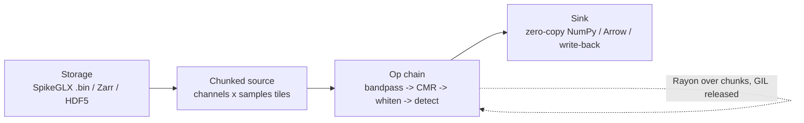
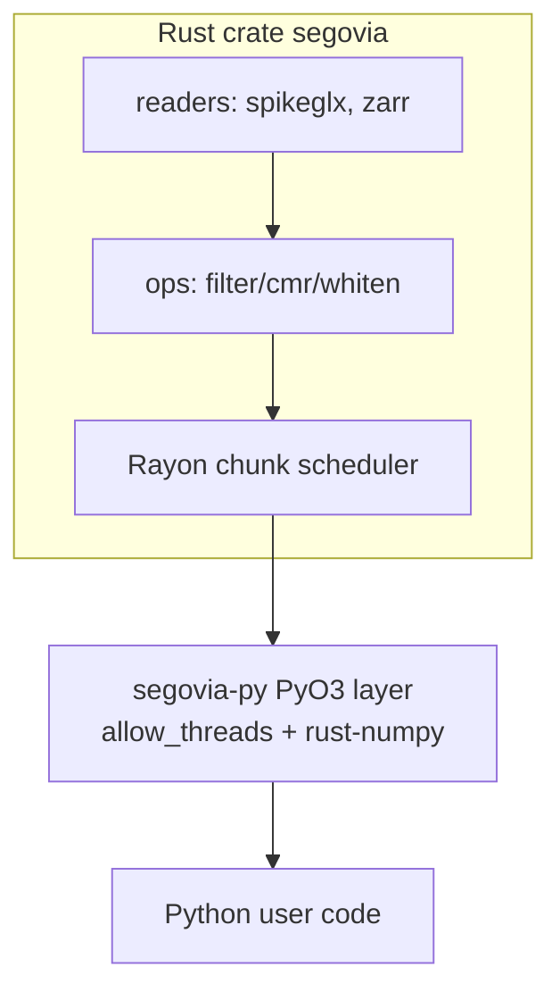
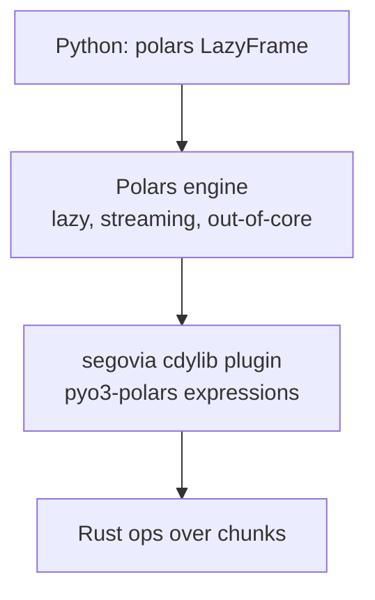

# Segovia — Candidate Architectures

This document presents four candidate architectures for the Segovia compute engine, with explicit
trade-offs, then a recommendation. All four assume the same foundations from the dossier: CPU
target, bounded-memory streaming, storage reuse (`zarrs`/`hdf5-metno`), and a PyO3 Python bridge.
They differ in **how compute is structured and how it ships to Python**.

A recurring theme: the value is **GIL-released shared-memory threading** over chunks, not raw
inner-loop speed. The architectures are judged largely on how cleanly they deliver that against
the incumbent's process-pool model.

---

## Shared context — the pipeline shape



The contest is over the **C (op chain)** box and the **D (bridge)** box.

---

## Candidate A — Standalone Rust crate + thin PyO3 wheel

A pure Rust library crate (`segovia`) with a separate, thin `segovia-py` PyO3 binding that exposes
recordings and operations to Python, returning zero-copy NumPy via `rust-numpy`.



| Pros | Cons |
|---|---|
| Cleanest separation; the Rust crate is usable/ testable without Python. | Must design the whole lazy/chunk API surface ourselves. |
| Full control over the lazy graph, chunking, and scheduling. | More API surface to build and document than plugging into an existing engine. |
| Zero-copy NumPy via `rust-numpy` is well-trodden (Polars, tokenizers). | No free interop — SpikeInterface integration is a separate adapter (FR11). |
| Easiest to also publish as a reusable Rust crate (crates.io impact). | Reinvents some dataframe/graph machinery Polars already has. |

**Effort:** Medium-High · **Risk:** Medium · **Differentiation:** High (we own the streaming model).

---

## Candidate B — Polars plugin (MaskOps-style)

Ship Segovia as a **native Polars expression plugin** (`cdylib` loaded by Polars), reusing the
exact pattern already shipped on MaskOps. Ephys signals are modeled as Polars columns / chunked
arrays; operations are Polars expressions backed by Rust.



| Pros | Cons |
|---|---|
| **Reuses Polars' lazy engine, streaming, and out-of-core for free** — huge scope reduction. | Polars is a *dataframe/relational* engine; dense 2D (channels × samples) signal kernels are an awkward fit. |
| Maintainer has shipped this exact pattern (MaskOps) — lowest tooling risk. | Multichannel time-series semantics (filter state across chunk boundaries) fight the columnar model. |
| Polars community / packaging momentum. | Filtering needs cross-chunk state (IIR), which Polars' chunk independence complicates. |
| Lazy graph, query optimization, spill-to-disk already exist. | Differentiation partly becomes "Polars is fast", not "Segovia is fast". |

**Effort:** Low-Medium · **Risk:** Medium (semantic mismatch) · **Differentiation:** Medium.

---

## Candidate C — Custom lazy operation-graph engine with its own scheduler

Build a deferred **operation DAG** (à la Dask/Polars-lazy, specialized for signals): operations
are recorded, optimized (fuse adjacent maps, push down channel selection), then executed by a
custom chunk scheduler with explicit memory budgeting and cross-chunk filter state.

```mermaid
flowchart TB
    api[Python lazy API] --> graph[Op DAG<br/>fuse + pushdown + memory plan]
    graph --> exec[Scheduler<br/>Rayon, bounded buffers, overlap IO+compute]
    exec --> out[zero-copy out / write-back]
```

| Pros | Cons |
|---|---|
| Best possible control over memory bounds, op fusion, and IO/compute overlap. | **Highest build cost** — a scheduler + optimizer is a large solo undertaking. |
| Cross-chunk filter state and deterministic output are first-class. | Easy to over-engineer before proving the core win (NFR/SC1). |
| Strongest long-term differentiation and headroom. | Longest time-to-first-benchmark — fights the M2–4 gate. |
| Naturally extends to multi-op pipelines without Python overhead per chunk. | Reinvents machinery (graph opt) that may not pay off vs simpler chunking. |

**Effort:** High · **Risk:** Medium-High (scope) · **Differentiation:** Very High.

---

## Candidate D — Thin Rayon-over-chunks streaming pipeline (no lazy graph)

The minimal viable engine: an eager, iterator-style chunk pipeline. A recording yields chunks;
operations are applied per chunk under `rayon`, GIL released; results stream to the sink. No
deferred graph, no optimizer.


| Pros | Cons |
|---|---|
| **Fastest path to the M2–4 benchmark gate** — least to build. | No op fusion / pushdown; multi-op chains re-traverse data. |
| Directly showcases the GIL-released-threads win vs SI process pools. | Cross-chunk filter state handled ad hoc per op. |
| Easy to reason about; minimal surface for bugs. | Weaker long-term story; may cap at the "~1.5–3×" risk zone. |
| Low risk; salvageable into A or C later. | Less "engine", more "fast functions". |

**Effort:** Low · **Risk:** Low · **Differentiation:** Low-Medium.

---

## Comparison summary

| Criterion | A: Standalone crate | B: Polars plugin | C: Custom DAG | D: Thin Rayon |
|---|---|---|---|---|
| Time to first benchmark | Medium | Medium | Slow | **Fast** |
| Scope reuse (less to build) | Medium | **High** | Low | High |
| Fit for multichannel signals | **High** | Low | **High** | Medium |
| Long-term differentiation | High | Medium | **Very High** | Low |
| Tooling risk for maintainer | Low | **Lowest** (proven) | Medium | Low |
| Memory-bound guarantees | High | Medium | **Highest** | Medium |
| Solo 12-month feasibility | Medium | **High** | Low | **High** |

---

## Recommendation

**Phase the architecture: start as D, grow into A. Evaluate B only as a distribution add-on, not
the core.**

1. **M2–4 (prove the win):** Build **Candidate D** — a thin Rayon-over-chunks pipeline for the MVP
   chain (bandpass + CMR + whiten). Its only job is to clear the **SC1 benchmark gate** on
   Windows/macOS with bounded memory, as fast as possible. This directly attacks the
   differentiation-collapse risk before any heavy investment.

2. **M4 onward (if the gate passes):** Refactor into **Candidate A** — a clean standalone
   `segovia` crate + thin `segovia-py` PyO3 layer, adding a *modest* lazy graph (compose ops
   without materializing intermediates, FR8) but **not** a full optimizer. This gives reusable
   crates.io impact, full control over multichannel/cross-chunk semantics, and a clean
   SpikeInterface adapter.

3. **Defer Candidate C's optimizer/scheduler** until real workloads prove a simple chunk pipeline
   is insufficient. Adopt fusion/pushdown only where a benchmark demands it. (YAGNI until proven.)

4. **Treat Candidate B (Polars plugin) as optional packaging**, attractive because the maintainer
   has shipped it before — but the columnar/dense-signal mismatch and the "Polars is fast, not
   Segovia" attribution problem make it wrong as the *core* engine.

**Why this fits the profile:** it front-loads the one experiment that can kill the project
(SC1), minimizes wasted effort, plays to strong-Rust/no-neuro strengths (systems over
algorithms), reuses proven MaskOps tooling, and keeps a credible path to high differentiation
without betting the year on building an optimizer first.

> **Open decision (OD1):** confirm the A-then-grow path vs leading with the Polars plugin — see
> `adr/0007-packaging-strategy.md`. Recommendation above is the architect's default.
